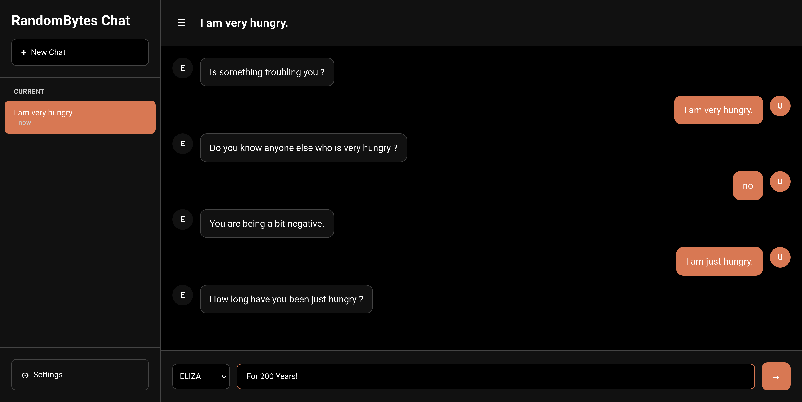

# Chat
Chat UI for Bots like ELIZA

## Setup
1. Clone the Repository.
2. Open the "index.html" File in your Browser or start a Webserver.

## Images
Screenshot of the UI before sending a message:

Screenshot of the UI while chatting:

## Add more bots
1. The bot must be ready to be integrated in the same way as ELIZA.
2. Move the Files of the bot in a new Folder in the "bots" Folder.
3. Add the Bot to the dropdown in the "index.html".
